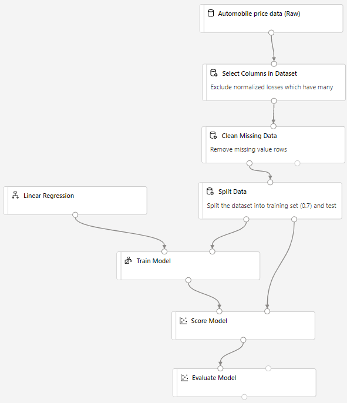
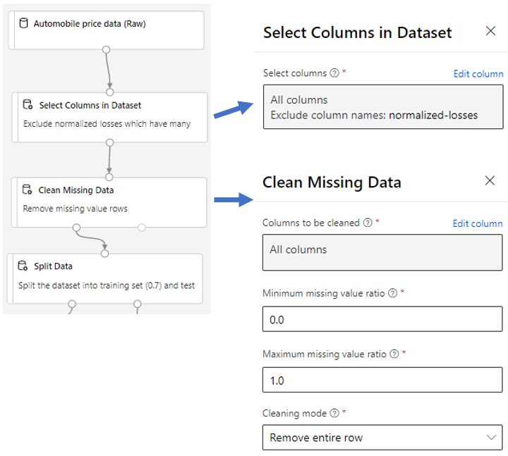
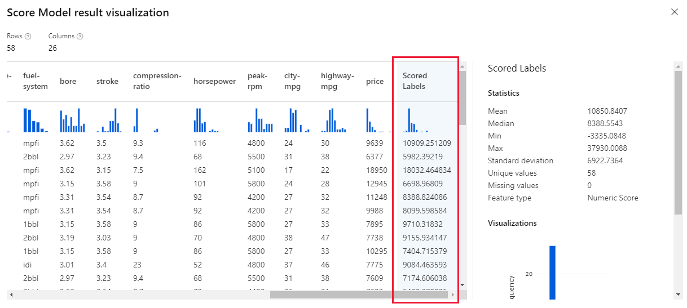
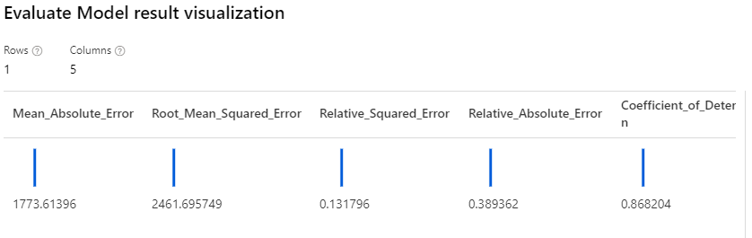
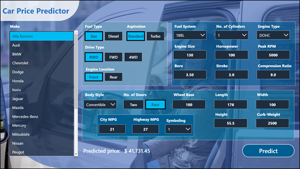

<div align="center">

# 🚗 Vehicle Price Prediction using Azure Machine Learning & Power BI

### End-to-End Regression Pipeline for Predictive Vehicle Pricing

<p align="center">
  
  
  
  
  
</p>

</div>

---

# 📌 Overview

This project presents an end-to-end **Machine Learning regression pipeline** for predicting vehicle prices using **Azure Machine Learning Designer** and **Power BI**.

The system analyzes structured automotive data and predicts vehicle prices based on technical specifications such as:

- Make & Model
- Horsepower
- Fuel Type
- Engine Size
- Body Style
- Number of Cylinders
- MPG & Vehicle Dimensions

The project demonstrates how Machine Learning and Business Intelligence can be combined to create predictive and decision-support systems.

---

# 🎯 Project Objectives

- Build a regression model for vehicle price prediction
- Use Azure Machine Learning Designer without coding-heavy workflows
- Perform data preprocessing and model evaluation
- Generate business insights using Power BI dashboards
- Visualize predictive analytics results interactively

---

# 🚀 Key Features

✅ End-to-end regression pipeline  
✅ Azure Machine Learning Designer workflow  
✅ Interactive car price prediction interface  
✅ Data preprocessing & cleaning  
✅ Regression model training & evaluation  
✅ Model scoring & prediction analysis  
✅ Power BI business dashboard integration  
✅ Predictive analytics visualization  

---

# 🛠️ Technologies Used

| Category | Technologies |
|---|---|
| Cloud Platform | Azure Machine Learning |
| Programming Language | Python |
| Machine Learning | Linear Regression |
| Data Analytics | Pandas, NumPy |
| Visualization | Power BI |
| ML Workflow | Azure ML Designer |

---

# 🧠 Machine Learning Workflow

The project follows the standard Machine Learning lifecycle:

```text
Dataset
   ↓
Data Preprocessing
   ↓
Data Cleaning
   ↓
Split Data
   ↓
Train Regression Model
   ↓
Score Model
   ↓
Evaluate Model
   ↓
Power BI Dashboard
```

---

# ⚙️ Azure ML Pipeline

The Machine Learning workflow was implemented using **Azure Machine Learning Designer**.

## 🔹 Complete Pipeline

<p align="center">
  
</p>

The pipeline includes:

- Dataset import
- Data preprocessing
- Missing value handling
- Data splitting
- Linear regression training
- Model scoring
- Performance evaluation

---

# 🧹 Data Preprocessing

Before training the model:

- Missing values were removed
- Irrelevant columns were excluded
- Features were cleaned and transformed

## 🔹 Data Processing Workflow

<p align="center">
  
</p>

---

# 🤖 Model Training

The project uses a **Linear Regression** model to predict vehicle prices.

### Why Regression?

Because the target variable (**price**) is continuous numerical data.

The dataset was divided into:
- 70% Training Data
- 30% Testing Data

---

# 📊 Model Scoring

After training, predictions were generated using the **Score Model** module.

## 🔹 Scored Predictions

<p align="center">
  
</p>

---

# 📈 Model Evaluation

The model performance was evaluated using Azure ML evaluation metrics.

## 🔹 Evaluation Results

<p align="center">
  
</p>

The evaluation helps measure:
- Prediction quality
- Regression accuracy
- Model performance

---

# 🖥️ Application Interface

An interactive prediction interface was created for vehicle price estimation.

## 🔹 Car Price Predictor UI

<p align="center">
  
</p>

The interface allows users to:
- Select vehicle specifications
- Modify technical features
- Predict vehicle prices interactively

---

# 📊 Power BI Integration

Machine Learning prediction outputs generated in Azure ML were integrated into **Power BI** to create interactive business dashboards.

The dashboard enables:
- Vehicle pricing analysis
- Brand comparison
- Price distribution visualization
- Business-oriented insights
- Interactive filtering and exploration

---

# 📂 Project Structure

```bash
vehicle-price-prediction-azure-ml/
│
├── data/
│   └── vehicles_dataset.csv
│
├── docs/
│   ├── overall-graph.png
│   ├── data-processing.png
│   ├── scored-label.png
│   ├── evaluate-model-output.png
│   └── car_price_predictor_ui.png
│
├── README.md
└── .gitignore
```

---

# 📈 Business Value

This project demonstrates how Machine Learning can support:

- Vehicle market analysis
- Pricing optimization
- Predictive analytics
- Automotive business intelligence
- Decision support systems

---

# 🚀 Future Improvements

- [ ] Compare multiple regression algorithms
- [ ] Deploy model as Azure endpoint
- [ ] Add real-time prediction API
- [ ] Integrate live Power BI dashboards
- [ ] Add advanced feature engineering
- [ ] Build full web application deployment
- [ ] Add deep learning regression models

---

# 👩‍💻 Author

<div align="center">

## Souad Zriouil

### AI Engineer | Data Scientist | Machine Learning | NLP | LLM

<p align="center">
  <a href="https://github.com/Souadzriouil">
    
  </a>

  <a href="https://www.linkedin.com/in/souad-zriouil-54b19b267">
    
  </a>
</p>

</div>

---

# ⭐ Support

If you find this project useful:

- ⭐ Star the repository
- 🔄 Share it on LinkedIn
- 📌 Add it to your portfolio

<div align="center">

⭐ Thanks for visiting this project!

</div>

---

# 📜 License

This project is intended for educational and portfolio purposes.
